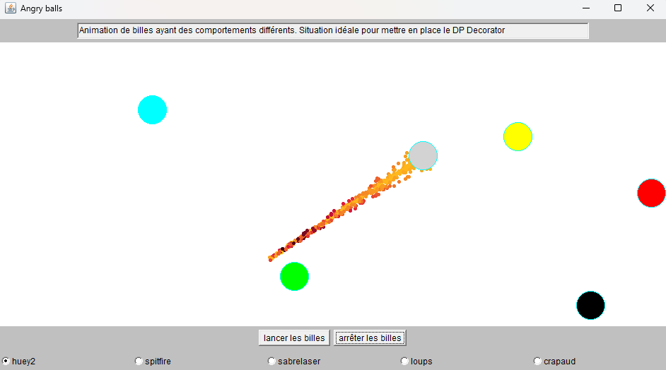

# Angry Balls — Decorator

A Java/AWT physics toy where billiard balls bounce, fall, attract one another, scream, catch fire,
and can be grabbed and thrown with the mouse. Every one of those behaviours is a **decorator**, so a
ball is assembled at run time by stacking behaviours rather than by picking a class.

Master 1 project for a Design Patterns course, 2023–2024.



---

## The problem this project solves

The application was handed out in a deliberately clumsy state. Each ball was an instance of its own
class, named after the exact combination of behaviours it carried:

```java
billes.add(new BilleMvtRURebond(p0, rayon, v0, Color.red));
billes.add(new BilleMvtPesanteurFrottementRebond(p1, rayon, v1, new Vecteur(0,0.004), Color.yellow, coeffFrottement));
billes.add(new BilleMvtNewtonFrottementRebond(p2, rayon, v2, Color.green, coeffFrottement));
billes.add(new BilleMvtRUPasseMurailles(p3, rayon, v3, Color.cyan));
billes.add(new BilleHurlanteMvtNewtonArret(p4, rayon, v4, Color.black, hurlements[choix], cadre));
billes.add(new BilleRebondFrottementFlamme(p5, rayon, v5, new Color(0x003399)));
```

Taking stock of what a ball can do gives three independent groups:

| Acceleration | Border | Extras |
|---|---|---|
| none (straight line, constant speed) | bounces off it | screams |
| pulled by the other balls (Newton) | stopped by it | trails a flame |
| pulled downwards (gravity) | goes through and wraps around | |
| slowed by the air (friction) | | |

Five cumulative behaviours and three mutually exclusive border responses make
**2⁵ × 3 = 96 combinations**. Six classes existed, so **ninety were still missing** — and inventing
one more force, say Lorentz, would have doubled the count again. Tying one class to each combination
is a dead end.

The assignment had two parts:

1. Rewrite the ball hierarchy with the **Decorator** pattern, then rebuild the original six balls by
   composition.
2. Add a new behaviour: a ball the user can **grab and throw** with the mouse, realistically — a big
   ball must be harder to throw than a small one, a held ball must keep the behaviours it already had,
   and it must still collide with the other balls instead of passing through them. This one requires
   **Decorator + State** together.

---

## Design patterns

### Overall architecture: Model–View–Controller

The packages map onto the three roles directly.

- **Model** — `maladroit.modele` and `maladroit.modele.torche`. The balls, their behaviours and
  their physics. It knows nothing about AWT, nothing about windows, nothing about the mouse.
- **View** — `maladroit.vues`. The frame, the billiard canvas, the buttons, and the AWT drawing code.
- **Controller** — `ControleurEtat*` turns mouse events into forces applied to a ball;
  `EcouteurBoutonLancer` and `EcouteurBoutonArreter` turn button clicks into start/stop commands;
  `AnimationBilles` drives the simulation clock on its own thread.

Keeping `java.awt` out of the model is what the Visitor below is for, and it is the reason the model
could be reused as is behind a different toolkit — a JavaFX or Android front end would mean writing a
new view, and changing nothing in `modele`.

### Decorator — the heart of the project

`Bille` is the component, `BilleNue` the concrete component holding state but no behaviour, and
`DecorateurBille` the abstract decorator. Each concrete decorator overrides only what it changes and
delegates the rest:

```java
Bille bille = new BilleNue(p, rayon, v, Couleur.JAUNE);
bille = new Pesanteur(bille, new Vecteur(0, 0.001));   // falls
bille = new Frottement(bille);                         // slowed by the air
bille = new Rebond(bille);                             // bounces off the sides
```

The decorators available:

| Decorator | Effect |
|---|---|
| `MvtRU` | straight line at constant speed |
| `MvtNewton` | gravitational pull of every other ball |
| `Pesanteur` | constant pull, direction and strength given at construction |
| `Frottement` | viscous friction with the air |
| `Rebond` | bounces off the sides |
| `Arret` | stopped dead by the sides |
| `PasseMuraille` | goes through the sides and reappears opposite |
| `Hurlement` | screams, louder and faster as the ball speeds up |
| `Flamme` | trails a flame |
| `PiloteeSouris` | can be grabbed and thrown |

The accelerations add up through the delegation chain. `gestionAccélération` calls `super` **first**,
which walks down to `BilleNue` where the vector is reset to zero, and each decorator then adds its own
term on the way back up. That is the physics rule `a = 0 + a_friction + a_newton + a_gravity` falling
straight out of the pattern, with no decorator ever needing to know which others are in the stack.

Reading a stack from the outside in is also what `toString` prints, so
`"Rebond, Frottement, Pesanteur, centre = ..."` is the yellow ball describing itself.

### State — the ball you can throw

A piloted ball answers the same three mouse events in two very different ways depending on whether it
is waiting to be grabbed or currently held. Rather than branching on a flag, `PiloteeSouris` forwards
every event to its current state and the states hand over to one another:

- `ControleurEtat1` — waiting. A press lands only if the pointer is inside the ball; it then hands
  over to the held state.
- `ControleurEtat2` — held. Each drag turns the movement of the pointer into an **acceleration**
  applied to the ball. A release hands back to the waiting state.

Applying a force rather than teleporting the ball is what makes the throw behave: the ball keeps
obeying its own behaviours and keeps colliding with the others while it is held. The push is divided
by the mass, and the mass follows the cube of the radius, so **a big ball really is harder to throw** —
the hand has to move faster to get the same result, which is exactly what the assignment asked for.

### Visitor — drawing without polluting the model

The model must not depend on a graphics library. But something has to draw it, and a ball, a spine and
a flame are all drawn differently.

`VisiteurDessinateur` declares one `visite` per drawable thing; `VisiteurDessinateurAWT`, living in the
view package, implements them with `java.awt`. The model only ever says *what it is*; the view decides
*how to paint it*. `Couleur` exists for the same reason — it carries a 24-bit RGB value so the model
never has to mention `java.awt.Color`.

### Proxy — the C++ flame server

The flame is a cloud of up to 5000 sparks whose positions and colours are recomputed on every frame.
Java is too slow for that, so the work is handed to a computation server written in C++.

`CreateurBellesFlammes` implements `CreateurFlammes` but holds no computation at all: it serialises the
request onto a TCP socket, waits, and deserialises the answer. `Flamme` holds a `CreateurFlammes` and
cannot tell whether the sparks were computed locally or in another process. When the server is
unreachable, the constructor catches the failure and installs `CreateurFlammesMock` instead, which
draws the bare spine — the application degrades instead of refusing to start.

---

## Repository layout

```
.
├── build.bat                      compile everything into out/
├── run.bat                        start the application
├── docs/screenshot.png
├── lib/                           third-party libraries (see below)
│   ├── malibrairiegui.jar         small GUI helpers
│   ├── malibsonique.jar           sound extraction and playback
│   └── mesmaths_sources_avec_awt.jar   vectors, kinematics, collisions, point mechanics
└── exodecorateur_angryballs/maladroit/
    ├── TestAngryBalls.java        entry point: assembles the six balls
    ├── AnimationBilles.java       simulation loop, on its own thread
    ├── ControleurEtat.java        State: shared base
    ├── ControleurEtat1.java       State: waiting to be grabbed
    ├── ControleurEtat2.java       State: held by the user
    ├── EcouteurBouton*.java       start / stop buttons
    ├── OutilsConfigurationBilleHurlante.java   loads the scream samples
    ├── bruits/                    audio assets and their configuration file
    ├── modele/
    │   ├── Bille.java             Decorator: component
    │   ├── BilleNue.java          Decorator: concrete component
    │   ├── DecorateurBille.java   Decorator: abstract decorator
    │   ├── MvtRU, MvtNewton, Pesanteur, Frottement        acceleration behaviours
    │   ├── Rebond, Arret, PasseMuraille                   border behaviours
    │   ├── Hurlement, Pilotee, PiloteeSouris              sound and mouse behaviours
    │   ├── OutilsBille.java       collisions and gravity across the whole set
    │   ├── Couleur.java           colour, free of any graphics library
    │   └── VisiteurDessinateur.java   Visitor: the drawing contract
    │   └── torche/
    │       ├── Flamme.java                 Decorator: the flame behaviour
    │       ├── Echine.java                 the spine the flame hangs on
    │       ├── CreateurFlammes.java        Proxy: the contract
    │       ├── CreateurBellesFlammes.java  Proxy: client of the C++ server
    │       ├── CreateurFlammesMock.java    Proxy: local fallback
    │       └── VecteurStream.java          binary (de)serialisation of vectors
    └── vues/
        ├── CadreAngryBalls.java   main window
        ├── Billard.java           the table, painted through paint()
        ├── BillardAR.java         the table, painted by active rendering
        ├── VueBillard.java        what the simulation needs from a view
        ├── VisiteurDessinateurAWT.java   Visitor: the AWT implementation
        └── BoutonChoixHurlement.java, PanneauChoixHurlement.java   scream picker
```

---

## Assets

**Audio.** `maladroit/bruits/` holds the configuration file and the sound samples. Six of the samples
are not in this repository: they are large, and they are course material I did not author. The two
small collision samples are kept, and `config_audio_bille_hurlante.txt` documents the format:

```
<name without .wav>  <start, hundredths of a second>  <end>  <number of chunks>
huey2 3000 3100 10
```

Without the missing samples the application still runs: loading falls back to a silent stand-in and
the scream picker shows a single entry. To get the full experience, drop `huey2.wav`, `spitfire.wav`,
`sabrelaser.wav`, `loups.wav` and `crapaud.wav` into that folder.

**The C++ flame server.** `TestServeurFlammes.exe` is a Windows binary distributed with the
assignment and is not in this repository. Without it the flame falls back to the mock, which draws the
bare spine as a trail of dots. With it, the flame is a real gradient cloud — that is what the
screenshot above shows. It listens on `127.0.0.1:3718` by default.

**The libraries.** The three `.jar` files under `lib/` were provided with the assignment and are
vendored here so the project builds out of the box. They are not my work.

---

## Running it

Requires a JDK 17 or later. Tested on Java 21.

```bat
build.bat
run.bat
```

Or, if you prefer to do it by hand from the root of the repository:

```bat
javac -encoding UTF-8 -cp "lib\malibsonique.jar;lib\mesmaths_sources_avec_awt.jar;lib\malibrairiegui.jar" -d out <every .java under exodecorateur_angryballs>
java -cp "out;lib\malibsonique.jar;lib\mesmaths_sources_avec_awt.jar;lib\malibrairiegui.jar" exodecorateur_angryballs.maladroit.TestAngryBalls
```

On Linux or macOS the same commands work with `:` instead of `;` as the classpath separator. The flame
server is a Windows binary, so the flame stays in mock mode there unless its C++ source is recompiled.

**Run from the root of the repository.** `TestAngryBalls` resolves the audio folder relative to the
working directory, as `exodecorateur_angryballs/maladroit/bruits`.

Once the window is up:

- **lancer les billes** starts the simulation, **arrêter les billes** stops it.
- The **grey ball** is the piloted one. Grab it with the mouse and throw it.
- The radio buttons along the bottom swap the sound of the black screaming ball while it runs.
- Starting `TestServeurFlammes.exe` before the application turns the flame from dots into a real one.

---

## Results

The six balls of the original application are rebuilt in `TestAngryBalls`, by composition only, with no
class written per combination:

| Ball | Stack | Behaviour |
|---|---|---|
| red | `Rebond(MvtRU(BilleNue))` | straight line, bounces off the sides |
| yellow | `Rebond(Frottement(Pesanteur(BilleNue)))` | falls, slowed by the air, bounces |
| green | `Rebond(Frottement(MvtNewton(BilleNue)))` | pulled by the others, slowed, bounces |
| cyan | `PasseMuraille(MvtRU(BilleNue))` | straight line, wraps around the sides |
| black | `Hurlement(Arret(MvtNewton(BilleNue)))` | pulled by the others, stopped by the sides, screams |
| grey | `Flamme(PiloteeSouris(Rebond(Frottement(BilleNue))))` | slowed, bounces, **grabbable and throwable**, trails a flame |

What this buys, concretely:

- **Adding a behaviour to a ball is one line.** Giving the red ball a flame is
  `bille1 = new Flamme(bille1);` and nothing else changes.
- **Inventing a behaviour is one class.** A Lorentz force is a new `DecorateurBille` overriding
  `gestionAccélération`; no existing class is touched, and it composes with everything already there.
- **All 96 combinations are reachable** without writing the 90 missing classes.

The grey ball is the answer to the second half of the assignment, and it is the stack that shows the
pattern paying off: `Flamme`, `PiloteeSouris`, `Rebond` and `Frottement` are four behaviours written
independently, by different parts of the project, that compose without any of them knowing about the
others. The ball can be caught mid-flight, thrown, and it keeps bouncing, keeps slowing down, keeps its
flame and keeps colliding with the other balls throughout — which is precisely what "the hand is simply
one more influence" was supposed to mean.
